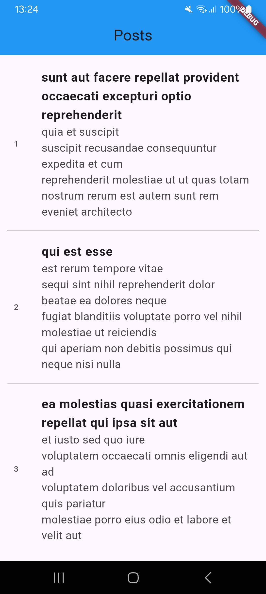

#  📌 Flutter Posts App (Clean Architecture)

## 📷 **Overview**
This is a **Flutter Posts App** that follows **Clean Architecture** principles. The app fetches posts from an API and caches them for offline access. It uses **Flutter BLoC**, **Dartz**, **Get_It for Dependency Injection**, and **SharedPreferences** for local storage.

## Code Structure
```bash
lib/
│── core/
│   ├── errors/
│   │   ├── exceptions.dart      # Custom exceptions (Server, Cache)
│   │   ├── failures.dart        # Failure messages
│   ├── network/
│   │   ├── network_info.dart    # Internet connectivity check
│
│── features/
│   ├── posts/
│   │   ├── data/
│   │   │   ├── data_sources/
│   │   │   │   ├── local_data_source.dart   # Local storage (SharedPreferences)
│   │   │   │   ├── remote_data_source.dart  # API call (JSONPlaceholder)
│   │   │   ├── models/
│   │   │   │   ├── post_model.dart  # Data model for Post
│   │   │   ├── repositories/
│   │   │   │   ├── post_repository_impl.dart  # Repository implementation
│   │   ├── domain/
│   │   │   ├── entities/
│   │   │   │   ├── post.dart  # Post entity
│   │   │   ├── repositories/
│   │   │   │   ├── posts_repository.dart  # Repository interface
│   │   │   ├── usecases/
│   │   │   │   ├── get_all_posts_usecase.dart  # Business logic
│   │   ├── presentation/
│   │   │   ├── bloc/
│   │   │   │   ├── posts_bloc.dart   # BLoC logic
│   │   │   │   ├── posts_event.dart  # BLoC events
│   │   │   │   ├── posts_state.dart  # BLoC states
│   │   │   ├── pages/
│   │   │   │   ├── posts_page.dart  # UI for displaying posts
│   │   │   ├── widgets/
│   │   │   │   ├── message_display_widget.dart  # Error message widget
│   │   │   │   ├── post_list_widget.dart  # List of posts widget
│   │   │   │   ├── loading_widget.dart  # Loading indicator
│
│── injection_container.dart  # Dependency injection setup
│── main.dart  # App entry point

```
## 🚀 **Features**
- Fetches posts from a **remote API** (JSONPlaceholder)
    
- Caches data **locally** for offline access
    
- Implements **Clean Architecture** with Domain, Data, and Presentation layers
    
- Uses **BLoC (Business Logic Component)** for state management
    
- Implements **dependency injection** using Get_It
## 📱 **Usage**
### **1. Data Layer**

- **RemoteDataSource:** Fetches posts from **JSONPlaceholder API**.
- **LocalDataSource:** Caches posts using **Shared Preferences**.
- **Repository Implementation:** Decides whether to fetch data from API or cache.

### **2. Domain Layer**

- **Entity:** `Post` defines the core data structure.
- **Use Case:** `GetAllPostsUsecase` handles fetching posts.
- **Repository Interface:** Defines the contract for data fetching.

### **3. Presentation Layer**

- **BLoC:** `PostsBloc` manages state.
- **UI Components:** `PostsPage`, `PostListWidget`, `MessageDisplayWidget`, `LoadingWidget`.
## 🔧 **Dependencies**
#### 🏗 **State Management & Dependency Injection**

- **Flutter BLoC** → https://pub.dev/packages/flutter_bloc
- **Get_It (Service Locator)** → https://pub.dev/packages/get_it

#### 📡 **Networking & API Calls**

- **HTTP (API Requests)** → https://pub.dev/packages/http
- **Internet Connection Checker** → https://pub.dev/packages/internet_connection_checker

#### 💾 **Local Storage**

- **Shared Preferences** → https://pub.dev/packages/shared_preferences

#### 🏗 **Functional Programming & Error Handling**

- **Dartz (Functional Programming in Dart)** → https://pub.dev/packages/dartz
- **Equatable (Simplifies Comparisons in BLoC)** → https://pub.dev/packages/equatable
## **Screenshots**

